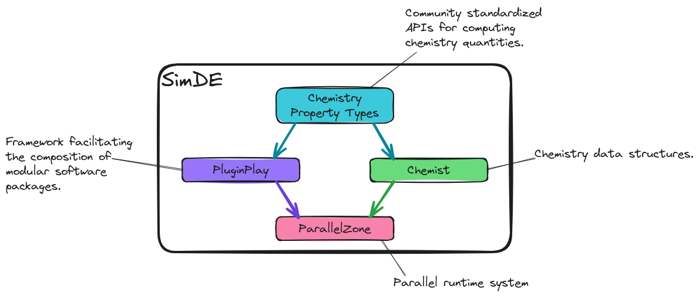
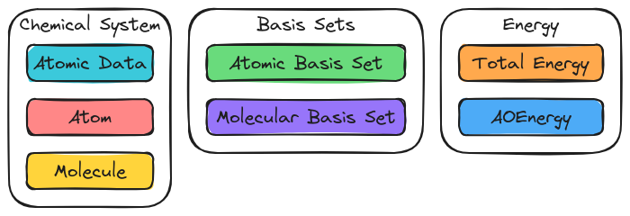

.. Copyright 2024 NWChemEx-Project
..
.. Licensed under the Apache License, Version 2.0 (the "License");
.. you may not use this file except in compliance with the License.
.. You may obtain a copy of the License at
..
.. http://www.apache.org/licenses/LICENSE-2.0
..
.. Unless required by applicable law or agreed to in writing, software
.. distributed under the License is distributed on an "AS IS" BASIS,
.. WITHOUT WARRANTIES OR CONDITIONS OF ANY KIND, either express or implied.
.. See the License for the specific language governing permissions and
.. limitations under the License.

.. _simde_overview:

##############
SimDE Overview
##############

:ref:`simde_statement_of_need` listed the reasons that SimDE was necessary. The
present section provides a high-level overview of SimDE.

**********************************
NWChemEx Ecosystem Development Kit
**********************************

We presume that most users of SimDE are using SimDE as an :term:`SDK` for
creating plugins and/or modules which are compatible with the NWChemEx
ecosystem.

.. _fig_simde_sdk:

   Overview of the SimDE SDK.

:numref:`fig_simde_sdk` summarizes the structure of the SDK provided by SimDE.

At the base of the SDK are three, somewhat independent, libraries:

- `ParallelZone <https://github.com/NWChemEx/ParallelZone>`__ is a parallel
  runtime system. ParallelZone provides abstractions for interacting with
  the resources (e.g., GPUs, CPUs, memory, processes, and file system) available
  to the program.
- `PluginPlay <https://github.com/NWChemEx/PluginPlay>`__ is an inversion-of-
  control framework which facilitates creating software packages from modular
  components. The resulting software package can be easily extended by users
  and developers by adding new modules.
- `Chemist <https://github.com/NWChemEx/Chemist>`__ provides data structures
  for concepts commonly encountered in computational chemistry (e.g. atoms,
  molecules, and wavefunctions).

Users of SimDE have direct access to all three of these libraries and are
encouraged to use these libraries directly. Generally speaking SimDE users
should NOT have to work with the dependencies underpinning ParallelZone,
PluginPlay, or Chemist.

.. note::

   If you encounter performance issues with any part of SimDE which would
   require bypassing the abstractions provided by that component please open
   an issue with the developers.

***********************
NWChemEx Property Types
***********************

In addition to serving as a meta-package, SimDE also provides the computational
chemistry property types used throughout NWChemEx. Property types help ensure
that modular software that is meant to be interoperable adheres to the same
interfaces.

.. _fig_property_types:

   Grouping of property types in SimDE. Within each component are high-level
   examples of the types of properties property types in that component can
   compute.

:numref:`fig_property_types` shows the categories of property types presently
in SimDE and the types of properties which can be computed. These categories
are summarized below.

Chemical System
===============

Property types in this category are designed to facilitate the creation of
objects from the Chemical System component of Chemist. Examples of property
types in this category include:

- Creation of ``Atom`` instances given the atomic number or atomic symbol.
- Mapping of string representations of a molecule to ``Molecule`` instances.

Basis Set
=========

Property types in this category help create molecular basis sets. Examples of
property types include:

- Creation of ``AtomicBasisSet`` objects from atomic number.
- Creation of ``AOBasisSet`` objects from ``Molecule`` objects.

Energy
======

Property types in this category compute energies of chemical systems. Examples
of property types include:

- Computing the total energy of a ``ChemicalSystem``.
- Computing the total energy given a ``ChemicalSystem`` and an ``AOBasisSet``.
